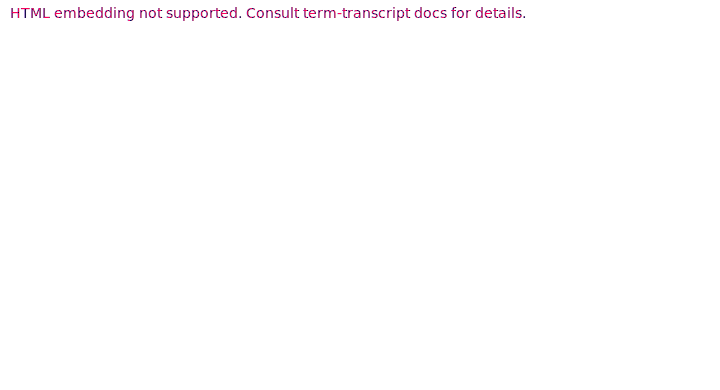

# Snapshot Showcase

This file showcases snapshot examples generated by the [`term-transcript` CLI app](../cli).
Consult the [generating script](generate-snapshots.sh) for details on preparing the environment.

## Basics

### Static snapshot


Generating command:

```shell
term-transcript exec -T 250ms --palette gjm8 rainbow
```

(`rainbow` is an executable for [end-to-end tests](../e2e-tests/rainbow).)

### Animated snapshot


Generating command:

```shell
term-transcript exec -T 250ms --palette powershell \
  --pty --window --scroll rainbow 'rainbow --long-lines'
```

Note the `--pty` flag to use a pseudo-terminal for capture instead of default pipes.

## Line numbering

### Separate numbering for each output


Generating command:

```shell
term-transcript exec -T 250ms --scroll --palette xterm \
  --line-numbers each-output \
  rainbow 'rainbow --short'
```

### Continuous numbering for outputs


Generating command:

```shell
term-transcript exec -T 250ms --scroll --palette powershell \
  --line-numbers continuous-outputs \
  rainbow 'rainbow --short'
```

### Continuous numbering for inputs and outputs


Generating command:

```shell
term-transcript exec -T 250ms --scroll --palette gjm8 \
  --line-numbers continuous \
  rainbow 'rainbow --short'
```

### Numbering with line breaks

As the example below shows, what is numbered are *displayed* lines
obtained after potential line breaking.



Generating command:

```shell
term-transcript exec -T 250ms --palette gjm8 \
  --line-numbers continuous \
  'rainbow --long-lines'
```

## Failed inputs

Some shells may allow detecting whether an input resulted in a failure
(e.g., *nix shells allow doing this by comparing the output of `echo $?` to 0,
while in PowerShell `$?` can be compared to `True`). Such failures are captured
and visually highlighted the default SVG template.

### Failures in `sh`


Generating command:

```shell
term-transcript exec -T 250ms --palette gjm8 --window \
  './non-existing-command' \
  '[ -x non-existing-file ]' \
  '[ -x non-existing-file ] || echo "File is not there!"'
```

### Failures in `bash`

Captured using a pseudo-terminal, hence colorful `grep` output.


Generating command:

```shell
term-transcript exec -T 250ms --palette gjm8 \
  --pty --window --shell bash \
  'ls -l Cargo.lock' \
  'grep -n serge Cargo.lock' \
  'grep -n serde Cargo.lock'
```

### Failures in `pwsh`


```shell
term-transcript exec --window --palette gjm8 \
  --shell pwsh './non-existing-command'
```
